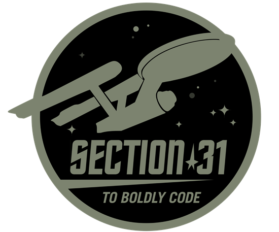
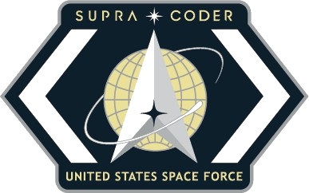
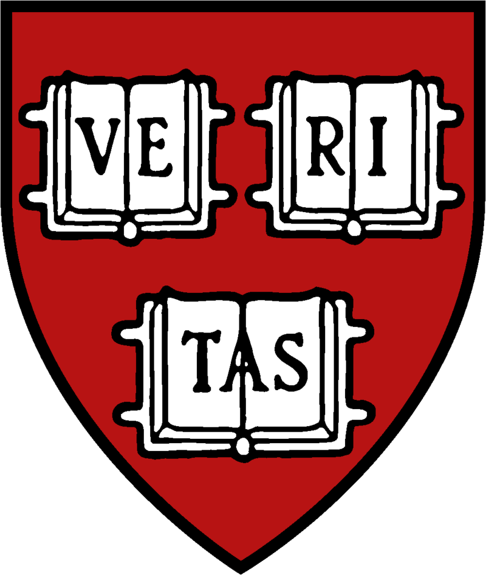

# Andrew
My high school computer science teacher said I was the most creative programmer he'd ever met.

&nbsp;&nbsp;&nbsp;&nbsp;&nbsp;&nbsp;&nbsp;

## Project Directory

### Publications
* [Cloud Quantum RNG For Cryptography](https://github.com/pham-andrew/Cloud-Quantum-Computer-RNG-for-Cryptography) (py): Harvard Master's Thesis
* [Satellite RCS ML Regression](https://github.com/pham-andrew/Satellite-RCS-ML-Regression) (ts): Air Force - MIT paper on predicting satellite RCS with ML regression
### Boilerplates
* [MERN Boilerplate](https://github.com/pham-andrew/MERN-boilerplate-ts) (ts): Andrew's preferred MERN stack staring point with CRUD example
* [MERN Boilerplate](https://github.com/pham-andrew/MERN-boilerplate) (js): Andrew's preferred MERN stack staring point with CRUD example
### Websites
* [MUItesting.com](https://github.com/pham-andrew/MUItesting.com) (js): Reference for testing MUI components with React Testing Library
* [anime.museum](https://anime.museum) (js): 3D virtual anime museum
### React Components
* [Chart In Tooltip](https://github.com/pham-andrew/chart-in-tooltip) (ts): Scatterplot chart embedded in a tooltip using dx react mui
* [Reddit Vote](https://gist.github.com/pham-andrew/1aaf8570fe092bc47026074c3f64925f) (js): Reddit style vote handling in react
### Other Web Apps
* [R2-D2](https://github.com/pham-andrew/R2-D2) (js): Rapid Routing and Decision Dashboard, document routing app
* [Stoked Custom Web Pages](https://github.com/pham-andrew/Stoked-Custom-Web-Pages) (css): Web applications comissioned by Stoked in 2017 developed with pure HTML CSS JS techniques
* [Ceullular Automata Rule 45](https://github.com/pham-andrew/Elementary-Cellular-Automata-Rule-45) (js): Calculates and displays the generational progress of Wolfram's Rule-45 cellular automaton
### Internet of Things
* [Boxing Wearable](https://github.com/pham-andrew/BoxingWearable) (c): Boxing glove sensor prototype that detects shadowboxing punches
* [Smart City Software System](https://github.com/pham-andrew/Smart-City-Software-System) (java): Device management in a smart city simulation
### Algorithms and Data Structures
* [B+ Tree](https://github.com/pham-andrew/BplusTree) (c): m-ary tree with a variable number of children per node
* [Graphics Math](https://github.com/pham-andrew/Graphics-Math) (c++): Manual implementation of basic graphics techniques such as edge detect, grayscale, blur, and crop
* [Cuckoo Hashing](https://github.com/pham-andrew/Cuckoo-Hashing) (c++): Cuckoo Hashing manual implementation
* [Rat18s Compiler](https://github.com/pham-andrew/Rat18s-Compiler) (c++): DFA with parser, lexer, and syntactic analyzer. Generates token list, parse tree, and machine code
### Cybersecurity
* [Mock Company Audit](https://github.com/pham-andrew/CyberSecurity-Audit): Blue Team scanning for and fixing vulnerabilities
* [Penetration Test Exercise](https://github.com/pham-andrew/Red-Teaming-Operations-Exercise): Red Team discovering and exploting vulnerabilities
### Artificial Intelligence & Machine Learning
* [Joi](https://github.com/pham-andrew/Joi) (py): Locally run AI assistant with persistent memory
* [Self Driving Jetbot](https://github.com/pham-andrew/Self-Driving-Jetbot) (py): Robot avoids obstacles and follows humans with computer vision
### Video Games
* [AnimeGuessr](https://pham-andrew.github.io/anime-guessr) (js): Guess the location of the Anime scene
* [Colors](https://github.com/pham-andrew/Colors) (py): 2D Maze Runner Game

These are all personal or educational projects.
