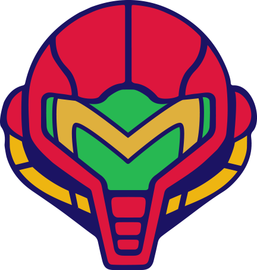

# Andrew
My GitHub contains a few projects related to my studies in video game design at CSUF, quantum computing at Harvard, and AI at MIT. There are also some websites I host through GitHub Pages. I work as a tech lead at the US Space force and this GitHub is not meant to act as portfolio as my personal projects are often unrelated to my day job.

&nbsp;&nbsp;&nbsp;&nbsp;&nbsp;&nbsp;&nbsp;
